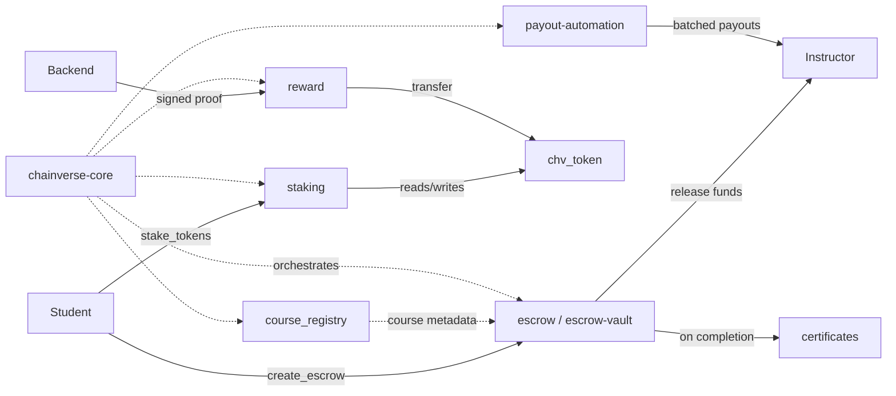

# chainVerse-onchain

[](https://github.com/Gen-x-academy/chainVerse-onchain/actions/workflows/ci.yml)

Smart contracts for the ChainVerse Academy platform — a decentralized Web3 education platform — built with [Soroban](https://soroban.stellar.org/) on the Stellar network.

## Getting Started

New to the project? [docs/testnet-setup.md](docs/testnet-setup.md) walks through installing the Stellar CLI, creating and funding a testnet identity, and building, deploying, initializing, and smoke-testing every contract on Stellar testnet.

## Contracts

| Contract | Path | What it does |
|---|---|---|
| `chv_token` | `contracts/chv_token` | Platform utility token (CHV) — mint, burn, transfer, admin handoff |
| `token` | `contracts/token` | Generic token implementation with royalty support |
| `certificates` | `contracts/certificates` | Mints and revokes on-chain course completion certificates |
| `course_registry` | `contracts/course_registry` | Stores and manages course metadata and enrollment records |
| `escrow` | `contracts/escrow` | Holds buyer funds until course delivery is confirmed or expiry |
| `escrow-vault` | `contracts/escrow-vault` | Multi-sig vault requiring threshold approvals before release |
| `payout-automation` | `contracts/payout-automation` | Batches token payouts to multiple instructor recipients |
| `reward` | `contracts/reward` | Issues one-time learner rewards via signed backend proofs |
| `staking` | `contracts/staking` | Tiered CHV staking with lock periods and emergency unstake |
| `chainverse-core` | `contracts/chainverse-core` | Integration layer tying the above contracts together |

`contracts/common` and `contracts/shared` are internal Rust libraries (not deployable contracts) used by the crates above.

## Architecture



See [docs/contracts-overview.md](docs/contracts-overview.md) for the full flow-by-flow breakdown.

## Prerequisites

- Rust 1.78 with the `wasm32-unknown-unknown` target (pinned in [`rust-toolchain.toml`](rust-toolchain.toml))
- [Stellar CLI](https://developers.stellar.org/docs/tools/stellar-cli) 21.x

## Quick Start

```sh
git clone https://github.com/Gen-x-academy/chainVerse-onchain
cd chainVerse-onchain

rustup target add wasm32-unknown-unknown
cargo install --locked stellar-cli@21.0.0 --features opt

stellar contract build
cargo test --workspace
```

## Testnet Deployment

See [docs/testnet-identity-setup.md](docs/testnet-identity-setup.md) for creating a funded testnet identity and deploying a contract. Pushes to `main` also trigger the [`deploy-testnet`](.github/workflows/deploy-testnet.yml) workflow.

## Contract Addresses

Deployed testnet contract IDs are not committed to this repo. Copy [`.env.testnet.example`](.env.testnet.example) to `.env.testnet` and fill in the IDs after deploying:

## Quick Start / Deployment Overview

See [docs/testnet-setup.md](docs/testnet-setup.md) for the full walkthrough. Summary:

1. Set up a funded testnet identity (see [docs/testnet-identity-setup.md](docs/testnet-identity-setup.md)).
2. Deploy all contracts:
   ```sh
   ./scripts/deploy-testnet.sh
   ```
3. Initialize all deployed contracts (admin, token, treasury, etc.):
   ```sh
   cp .env.testnet.example .env.testnet   # fill in contract IDs from step 2
   ./scripts/init-contracts.sh
   ```
4. Verify every contract is live and responding:
   ```sh
   ./scripts/smoke-test.sh
   ```
5. To upgrade a deployed contract, call its `upgrade` function with the new WASM hash (all 8 core contracts expose this, admin-gated):
   ```sh
   ./scripts/upgrade-contract.sh testnet deployer <contract-name> <path-to-new-wasm>
   ```
| Env var | Contract |
|---|---|
| `CHV_TOKEN_CONTRACT_ID` | `contracts/chv_token` |
| `CERTIFICATES_CONTRACT_ID` | `contracts/certificates` |
| `ESCROW_CONTRACT_ID` | `contracts/escrow` |
| `ESCROW_VAULT_CONTRACT_ID` | `contracts/escrow-vault` |
| `CHAINVERSE_CORE_CONTRACT_ID` | `contracts/chainverse-core` |
| `REWARD_CONTRACT_ID` | `contracts/reward` |
| `COURSE_REGISTRY_CONTRACT_ID` | `contracts/course_registry` |
| `PAYOUT_AUTOMATION_CONTRACT_ID` | `contracts/payout-automation` |
| `STAKING_CONTRACT_ID` | `contracts/staking` |

## Contributing

See [CONTRIBUTING.md](CONTRIBUTING.md) for setup, the Soroban contract checklist, and PR requirements.
