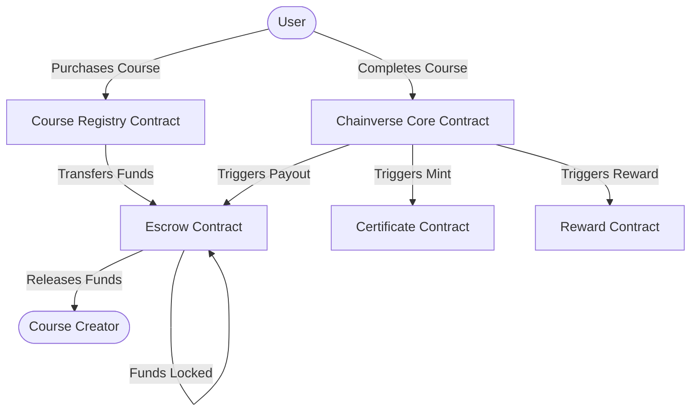

# Chainverse Smart Contracts Architecture

This document describes the high-level architecture of Chainverse on-chain components.

## Architecture Diagram

## Description of Components

1. **Course Registry**: Manages the listing, pricing, and purchase state of various courses.
2. **Escrow**: Securely holds the payment from a user until the course is definitively completed or another condition is met. 
3. **Chainverse Core**: The central hub that orchestrates the actions upon course completion.
4. **Certificate**: Issues non-fungible tokens or certificates representing the completion of courses.
5. **Reward**: Manages the distribution of token rewards to users who successfully finish courses.
