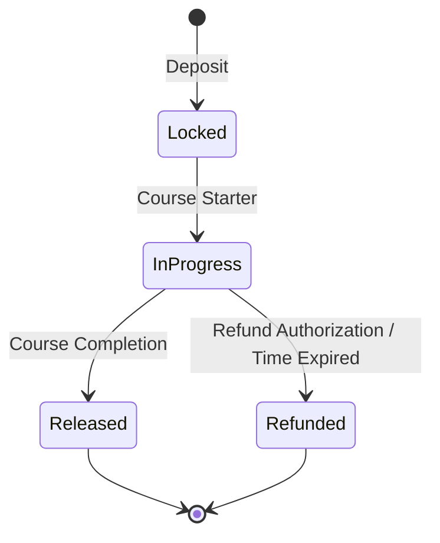

# Escrow Lifecycle

This document explains the lifecycle of the escrow contract operations in Chainverse.

## Lifecycle States

1. **Unlocked (Initial)**
   - Before an escrow transaction starts, funds are not committed.

2. **Locked**
   - The user deposits the required token amount or purchases a course.
   - The smart contract safely secures the funds, holding them until the course completes or until a refund condition applies.

3. **In-Progress**
   - User works on completing the course modules.
   - The funds remain securely locked inside the Escrow.

4. **Released (Success)**
   - Upon course completion or fulfillment of requirements, the Escrow transitions to the **Released** state.
   - The funds are transferred to the creator's wallet or dynamically proportioned to validators and creators.

5. **Refunded (Failure/Cancellation)**
   - Should the course be canceled, or a user opt-out within an eligible refund window, the Escrow triggers an authorized fallback.
   - Funds are returned to the user's wallet.

## Diagram Flow

