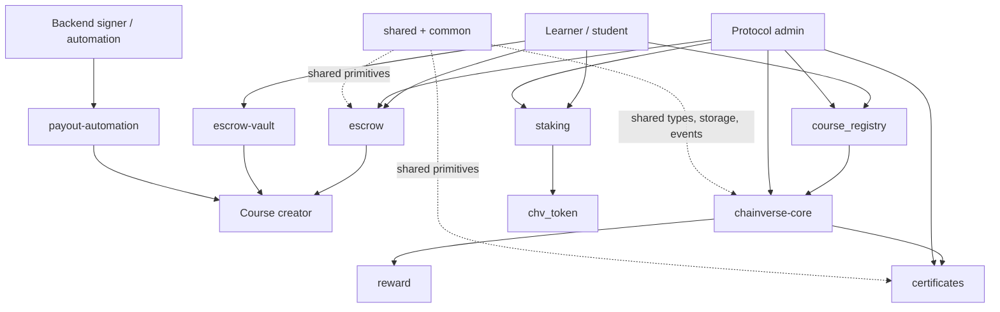

# ChainVerse Contracts Overview

This overview maps the on-chain packages in `contracts/Cargo.toml`, explains
the role of each contract or shared crate, and shows how the pieces fit
together in the main learning and payment flows.

## Contract map

## Workspace packages

| Package | Type | Role | Cargo.toml |
| --- | --- | --- | --- |
| `chainverse-core` | Contract | Main protocol coordinator for configuration, pause controls, supported tokens, analytics, and a core escrow lifecycle. | [`contracts/chainverse-core/Cargo.toml`](../contracts/chainverse-core/Cargo.toml) |
| `course_registry` | Contract | Registry for course metadata and active/inactive course status. | [`contracts/course_registry/Cargo.toml`](../contracts/course_registry/Cargo.toml) |
| `escrow` | Contract | Payment escrow for buyer/seller flows, token allowlisting, fee accounting, disputes, release, and refund. | [`contracts/escrow/Cargo.toml`](../contracts/escrow/Cargo.toml) |
| `escrow-vault` | Contract | Vault-style escrow that tracks vault status and approval before release or cancellation. | [`contracts/escrow-vault/Cargo.toml`](../contracts/escrow-vault/Cargo.toml) |
| `certificates` | Contract | Certificate minting and verification contract for course-completion credentials. | [`contracts/certificates/Cargo.toml`](../contracts/certificates/Cargo.toml) |
| `payout-automation` | Contract | Authorized payout queue/execution helper for automated creator or participant payouts. | [`contracts/payout-automation/Cargo.toml`](../contracts/payout-automation/Cargo.toml) |
| `staking` | Contract | Staking configuration, tier creation, staking, unstaking, emergency unstaking, and penalty withdrawals. | [`contracts/staking/Cargo.toml`](../contracts/staking/Cargo.toml) |
| `chv_token` | Contract | ChainVerse token contract exposing initialize, balance, transfer, version, and upgrade operations. | [`contracts/chv_token/Cargo.toml`](../contracts/chv_token/Cargo.toml) |
| `shared` | Library crate | Shared storage, events, errors, and types used by contracts. | [`contracts/shared/Cargo.toml`](../contracts/shared/Cargo.toml) |
| `common` | Library crate | Common helpers and shared test/regression utilities. | [`contracts/common/Cargo.toml`](../contracts/common/Cargo.toml) |

The existing architecture notes also reference a reward component under
[`contracts/reward`](../contracts/reward). In the current tree it has source and
a README but is not listed as a workspace member and does not include its own
`Cargo.toml`; treat it as an auxiliary reward module until it is promoted into
the workspace.

## Contract roles

### `chainverse-core`

`chainverse-core` is the central coordinator. It initializes protocol config,
tracks admin state, supports pause/unpause and admin transfer, stores supported
tokens, exposes escrow lifecycle helpers, and reports analytics such as escrow
stats and event counts. Use it when a caller needs the protocol-level view of
configuration, supported tokens, and core escrow records rather than a
standalone course or certificate operation.

### `course_registry`

`course_registry` owns course records. It initializes an admin, upserts course
metadata, toggles or deactivates courses, reads course details, and exposes
`assert_course_active` for flows that must reject inactive course IDs. It is the
first place to look when a course must be listed, updated, hidden, or validated
before payment or completion.

### `escrow`

`escrow` is the buyer/seller payment escrow. It sets an admin, allowlists
tokens, creates escrow records, releases funds, refunds buyers, tracks total
volume and protocol fees, flags disputes, resolves disputes, withdraws fees, and
supports contract upgrade. This is the main fund-movement boundary for course
purchases or marketplace payments where a buyer's payment must be held before
release.

### `escrow-vault`

`escrow-vault` is a vault-oriented escrow alternative. It stores vault records,
supports creation, approval-based release, cancellation, and admin upgrade. Use
it for flows that need explicit vault state and approval tracking instead of the
broader buyer/seller escrow API.

### `certificates`

`certificates` mints and verifies completion credentials. It initializes with an
admin and backend public key, supports pause controls, mints certificates from a
verified proof path, revokes certificates, reads certificate state, checks
whether a wallet has a course certificate, supports transfer, and can be
upgraded by the authorized path. It should be invoked after course completion is
verified.

### `reward` auxiliary module

`contracts/reward` handles learner reward claims in the existing architecture
notes, but it is not a member of `contracts/Cargo.toml` in the current tree. Its
source initializes treasury/backend configuration, rotates the backend public
key, exposes the current key, and lets users claim rewards. Its
[`README.md`](../contracts/reward/README.md) notes that the treasury must
pre-approve the reward contract as a spender for the reward token before claims
can succeed.

### `payout-automation`

`payout-automation` manages authorized payout execution. It initializes an
admin, adds or removes authorized callers, executes payout entries, and supports
upgrade. It is the automation boundary for backend-driven payout distribution
after off-chain rules decide who should be paid.

### `staking`

`staking` manages staking policy and stake positions. It sets admin state,
stores staking config, creates staking tiers, lets users stake/unstake, supports
emergency unstake, tracks stake info, exposes staking config, withdraws
penalties, and supports upgrade. It connects token holding to protocol
participation, tiers, or penalties.

### `chv_token`

`chv_token` is the ChainVerse token contract. It initializes admin/token state,
reports total supply, decimals, balances, supports transfers, exposes a version
string, and supports upgrade. Other contracts can use it as the value or reward
asset in escrow, reward, payout, or staking flows.

### `shared` and `common`

`shared` and `common` are support crates rather than standalone user-facing
contracts. `shared` centralizes reusable error, event, storage, and type
definitions. `common` contains reusable helpers, vesting/storage utilities, and
test/regression scaffolding. Update these crates carefully because changes can
affect multiple contracts at once.

## Key flows

### Student buys a course

1. `course_registry` confirms that the course exists and is active.
2. `chainverse-core` or the application backend reads protocol config such as
   supported tokens and protocol fee settings.
3. `escrow` creates the payment escrow between the learner and creator.
4. While the course is in progress, funds remain locked in `escrow` or
   `escrow-vault`.
5. On successful completion, `escrow` releases funds to the creator. If the flow
   fails or expires, refund or dispute resolution paths decide the outcome.

### Student completes a course

1. The backend or learning app verifies completion off-chain.
2. `certificates` mints a completion certificate for the learner and course.
3. `reward` can process a learner reward claim when the backend signature and
   treasury allowance requirements are satisfied.
4. `payout-automation` can execute any additional creator, validator, or
   participant payout entries produced by the backend settlement process.

### Admin configures protocol operations

1. Admin initializes and configures `chainverse-core`.
2. Admin lists supported payment tokens and protocol fee policy.
3. Admin configures `course_registry`, `escrow`, `certificates`, `staking`, and
   payout authorization as needed.
4. Pause controls on core or credential contracts can be used during incidents
   while read-only queries remain useful for diagnosis.

### Token, rewards, and staking

1. `chv_token` represents the ChainVerse token asset.
2. `reward` distributes approved token rewards to eligible users.
3. `staking` accepts token stake positions, applies tier policy, and tracks
   penalties or emergency unstake flows.
4. `payout-automation` can coordinate backend-authorized payout entries that
   complement reward and staking flows.

## Where to start as a contributor

- New protocol contributors should start with
  [`contracts/README.md`](../contracts/README.md), then read
  [`contracts/docs/architecture.md`](../contracts/docs/architecture.md).
- Course-listing work usually starts in
  [`contracts/course_registry`](../contracts/course_registry).
- Payment and dispute work usually starts in
  [`contracts/escrow`](../contracts/escrow) or
  [`contracts/escrow-vault`](../contracts/escrow-vault).
- Completion credentials usually start in
  [`contracts/certificates`](../contracts/certificates).
- Reward and payout work usually starts in
  [`contracts/reward`](../contracts/reward) and
  [`contracts/payout-automation`](../contracts/payout-automation).
- Token or stake-related work usually starts in
  [`contracts/chv_token`](../contracts/chv_token) and
  [`contracts/staking`](../contracts/staking).
